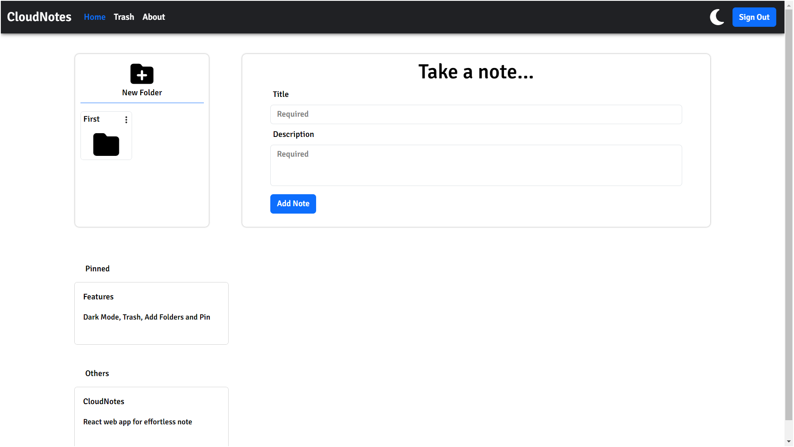

# CloudNotes


  
React web app for effortless note management. Create, update, and delete notes seamlessly. User-friendly interface for efficient note-taking, perfect for organizing thoughts and tasks. Similar to Google Notes.

## Features

- **Note Creation and Editing**: Easily create new notes and edit existing ones with a straightforward user interface.

- **Real-Time Updates**: Changes to notes are reflected instantly, ensuring users always have the latest version.


## Installation

To get a local copy up and running, follow these steps:

1. **Clone the repository**:
    ```sh
    git clone https://github.com/Dileep01712/CloudNotes.git
    ```

2. **Navigate to the project directory**:
    ```sh
    cd CloudNotes
    ```

3. **Install dependencies**:
    ```sh
    npm install
    ```

4. **Start the development server**:
    ```sh
    npm start
    ```

## Usage

Open your browser and navigate to `http://localhost:3000/` to use the application.

## Contributing

Contributions are welcome! Please follow the steps below to contribute:

1. Fork the Project
2. Create your Feature Branch (`git checkout -b feature/AmazingFeature`)
3. Commit your Changes (`git commit -m 'Add some AmazingFeature'`)
4. Push to the Branch (`git push origin feature/AmazingFeature`)
5. Open a Pull Request

## License

Distributed under the MIT License. See `LICENSE` for more information.

## Contact

Project Link: [https://github.com/Dileep01712/CloudNotes](https://github.com/Dileep01712/CloudNotes)
