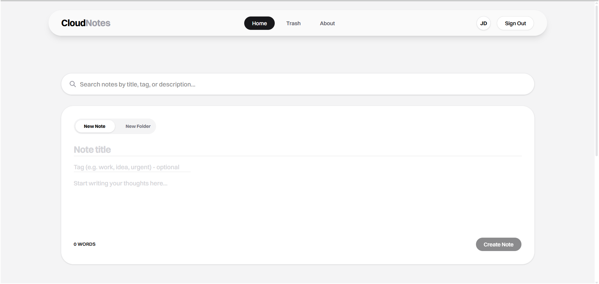

# CloudNotes


  
A responsive, modern React and Vite-based web application for effortless note management. Create, update, and delete notes seamlessly. Featuring a user-friendly interface for efficient note-taking—perfect for organizing thoughts and tasks.

## Tech Stack
* **Framework:** React with Vite & TypeScript
* **Styling:** Tailwind CSS
* **State Management:** React Context API
* **Routing:** React Router DOM

## Key Features
* **Silent Token Refresh:** Custom hook intercepts 401 errors and automatically rotates HTTP-only cookies in the background without interrupting the user.
* **Real-time Note Composer:** Live word count tracking and dynamic text area resizing based on content. Changes to notes are reflected instantly.
* **Trash & Restore:** Soft-delete functionality allowing users to view trashed items, restore folders, or permanently delete them.
* **OTP Verification:** Secure email verification and password reset flows directly integrated into the UI.
* **Responsive Design:** Mobile-first architecture that seamlessly adapts to tablets and desktops.

## Installation

To get a local copy up and running, follow these steps:

1. **Clone the repository**:
    ```sh
    git clone [https://github.com/Dileep01712/CloudNotes.git](https://github.com/Dileep01712/CloudNotes.git)
    ```

2. **Navigate to the frontend directory**:
    ```sh
    cd CloudNotes
    # If your frontend is in a subfolder, navigate into it (e.g., cd frontend)
    ```

3. **Install dependencies**:
    ```sh
    npm install
    ```

4. **Set up Environment Variables**:
    Create a `.env` file in the root of your frontend directory and add your backend connection URL:
    ```env
    # Point this to your local backend, your network IP, or your production API
    VITE_SERVER_URL=http://localhost:8000
    ```

5. **Start the development server**:
    ```sh
    npm run dev
    ```

## Usage

Open your browser and navigate to `http://localhost:5173/` to use the application.

## Contributing

Contributions are welcome! Please follow the steps below to contribute:

1. Fork the Project
2. Create your Feature Branch (`git checkout -b feature/AmazingFeature`)
3. Commit your Changes (`git commit -m 'Add some AmazingFeature'`)
4. Push to the Branch (`git push origin feature/AmazingFeature`)
5. Open a Pull Request

## License

Distributed under the MIT License. See `LICENSE` for more information.

## Contact

Project Link: [https://github.com/Dileep01712/CloudNotes](https://github.com/Dileep01712/CloudNotes)